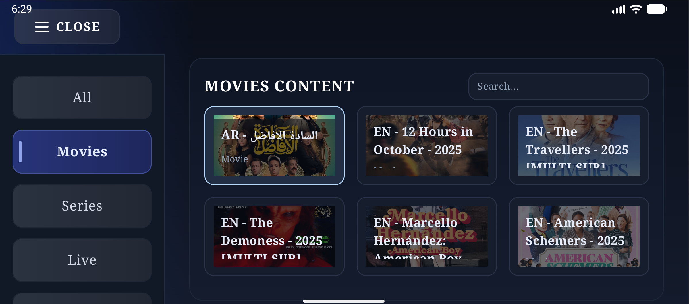
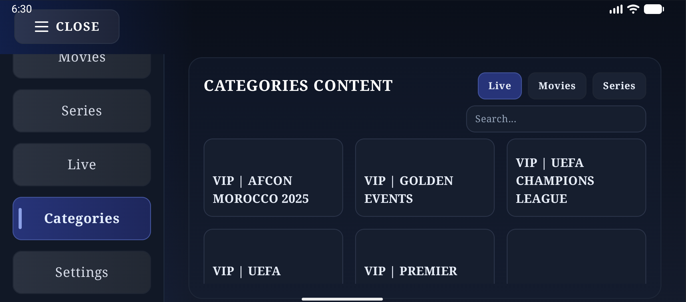

# XtreamPlayer

XtreamPlayer is an Android TV / Google TV–focused IPTV player designed for TV remotes and large screens.

It is a media player frontend only and requires user-provided Xtream Codes credentials.

## Features
- Designed for Android TV / Google TV
- Optimized for DPAD / remote navigation
- Xtream Codes login support
- Layout tailored for large screens

## Requirements
- Android 7.0 (API 24) or newer
- Android TV or Google TV device (Leanback)

## Disclaimer
This app does not provide any content.
You must supply your own Xtream Codes credentials
(such as a server URL, username, and password provided by your service).

## Development

Debug build:
```bash
./gradlew :app:assembleDebug -Pandroid.injected.build.abi=
```

Release build (unsigned):
```bash
./gradlew :app:assembleRelease -Pandroid.injected.build.abi=
```

Signed release APKs are published on GitHub Releases.
The release keystore is private and not stored in this repo.

## screenshots


